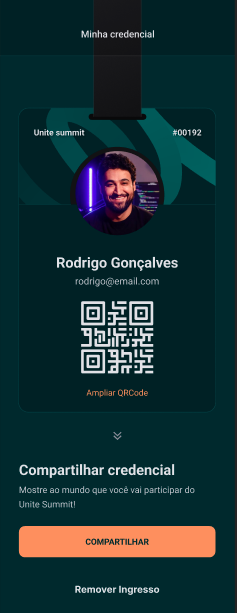

<p align="center">
    <a href="#-projeto">🖥 Projeto</a>&nbsp;&nbsp;&nbsp;|&nbsp;&nbsp;&nbsp;
    <a href="#-projeto">🔗 Links</a>&nbsp;&nbsp;&nbsp;|&nbsp;&nbsp;&nbsp;
    <a href="#-tecnologias">👨‍💻 Tecnologias</a>&nbsp;&nbsp;&nbsp;|&nbsp;&nbsp;&nbsp;
    <a href="#-executar-o-projeto">🖇 Execução do Projeto</a>&nbsp;&nbsp;&nbsp;|&nbsp;&nbsp;&nbsp;
    <a href="#-licença">📃 Licença</a>&nbsp;&nbsp;&nbsp;|&nbsp;&nbsp;&nbsp;
    <a href="#-observações">📌 Observações</a>
</p>
<div style="display: flex; flex-direction: row; justify-content: center; align-items: center; flex-wrap: wrap"  align="center">
    

    
</div>


## 🖥 Projeto
O **Pass.in** é um projeto desenvolvido em conjunto com o evento NLW UNITE, promovido pela Rocketseat. É um aplicativo móvel, que tem como função, verificar sua inscrição no evento e gerar sua credencial, para que possa ser compartilhada com outros devs.

## 👨‍💻 Tecnologias
As tecnologias usadas nesse projeto foram:
- [React Native](https://reactnative.dev/)
- [Expo](https://expo.dev/)
- [NativeWind](https://www.nativewind.dev/)
- [Zustand](https://docs.pmnd.rs/zustand/getting-started/introduction)
- [Moti](https://moti.fyi/)


## 🔗 Links
🎨 Link para o design do projeto: [Figma - Pass.in](https://www.figma.com/file/KfXBPGh4x0mykabMDCHi9e/pass.in-(Community)?type=design&node-id=7-2&mode=design&t=LT6rlenOXzRB4AgI-0)


## 🖇 Executar o Projeto
Para executar o projeto, é preciso clonar ele em seu dispositivo:

- Clone o repositório:
    ```bash
    $ git clone https://github.com/Yta-ux/pass.in.git
    ```
- Acesse o projeto:
    ```bash
    $ cd pass.in
    ```
- Baixe suas dependências:
    ```bash
    $ npm install
    ```
- Execute o comando para inicializar o expo:
    ```bash
    $ npm start
    ```
 
##  📃 Licença
Esse projeto possui licença MIT. Para mais detalhes consulte o arquivo [LICENSE](LICENSE.md)


## 📌 Observações
- Para acessar o backend, basta acessar o github da rocketseat e clonar o repositório do backend do pass.in - [Backend Pass.in]("https://github.com/rocketseat-education/nlw-unite-nodejs");
